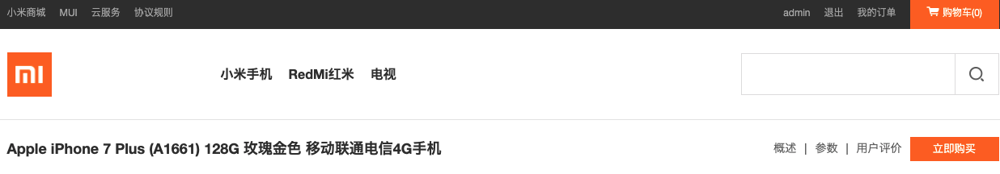

### Shopping Mall Demo

使用**SpringBoot**开发的网购商城系统。

>**开发框架及工具**：
SpringBoot、MySql、Mybatis、Lombok等 
-----------------------

>**演示Demo**

_为方便演示使用admin用户名登陆，密码也为admin，支付环节发起支付后金额自动变为0.01。登陆状态只保存2分钟。_  
_1. 登陆界面_  
  
_2. 查看一个商品_  
  
_点击进入商品界面_  
  
_3. 加入购物车_  
_点击"立即购买"进入详情页 => "加入购物车" （目前只有商品id26、27、28、29，为方便测试可在详情页url处更换productId查看不同商品）_ 
  
_4. 结算生成订单_  
  
  
_5. 订单完成后自动跳转到订单列表_  

